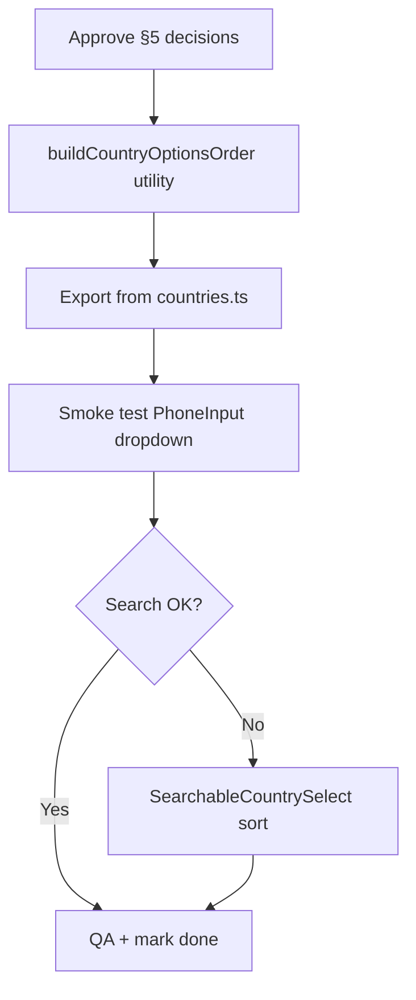

# Implementation plan: country list — UK first, then dial codes +1 → highest

**Status:** Planning only — no code until approved.  
**Created:** 2026-06-03  
**Related:** `implementation_phonenumber.md`, `src/lib/phone/countries.ts`, `src/components/phone/SearchableCountrySelect.tsx`

---

## 1. Goal

Change the **country dropdown** in the phone input so that:

1. **United Kingdom (`GB`, +44)** is always the **first** row (flag, name, `+44`).
2. **Every other supported country** appears **below**, sorted by **international calling code in ascending numeric order** — starting with **+1** (USA and other NANP territories) and ending with the **highest** dial code in the dataset (e.g. **+998** Uzbekistan).
3. When several countries share the same code (e.g. +1, +44, +7), use a **stable secondary sort** so the list is predictable (recommended: **country name A→Z** within the same code).

This matches the screenshot reference: UK on top, then a dial-code-ordered list — not the current “hand-picked 8 countries first, everything else in library default order.”

---

## 2. Out of scope

| Item | Reason |
|------|--------|
| Changing validation, E.164 storage, or Supabase | Already done in phone implementation |
| Changing default selected country | Stays `GB` |
| Changing business phone `07365519615` | Unrelated |
| Reordering search **results** by relevance instead of dial code | Optional enhancement (§6.4) |
| Showing only a subset of countries | Full library list remains |

---

## 3. Current behaviour

| Piece | Today |
|-------|--------|
| `src/lib/phone/countries.ts` | Static `COUNTRY_OPTIONS_ORDER`: `GB`, then `IE`, `US`, `FR`, `DE`, `AU`, `CA`, `NZ` |
| `react-phone-number-input` | `sortCountryOptions()` pulls listed countries to the top; **all others keep default order** (effectively alphabetical by label in the English locale) |
| `SearchableCountrySelect.tsx` | Renders `options` in the order received; search filters but does not re-sort |
| User-visible list | UK first, then a small preferred block, then unrelated order for ~200+ countries |

**Problem:** After Ireland (+353) and a few picks, France (+33) can appear **above** United States (+1) because +33 < +353 numerically but the list is **not** globally sorted by dial code.

---

## 4. Target behaviour (acceptance criteria)

### 4.1 Default list (no search)

| Position | Example rows | Rule |
|----------|----------------|------|
| 1 | 🇬🇧 United Kingdom `+44` | Always `GB` only (not GG, IM, JE in slot 1 unless product says otherwise — see §5.2) |
| 2…n | 🇺🇸 United States `+1`, 🇨🇦 Canada `+1`, … then `+20`, `+27`, … `+998` | All **other** countries, sorted by **numeric** `getCountryCallingCode(country)` ascending |
| Within same code | US before Canada, or both +1 — alphabetical by **English label** | Tie-break |

### 4.2 Visual optional divider

Optional thin divider **between UK and the rest** (library supports `'|'` in `countryOptionsOrder`) for scanability — product choice (§5.3).

### 4.3 Search

When the user types in “Search country or code…”:

- **Minimum (v1):** Show all matches; order matches **same global sort** (UK matches still appear in list position by sort key, or pin UK matches first — decide in §5.4).
- **Recommended (v1):** Filter only; keep **dial-code sort** among visible rows (no random order).

### 4.4 No regressions

- [ ] Default country on load remains GB (+44).
- [ ] Selecting any country still updates prefix and validation.
- [ ] `npm run typecheck`, `npm run build`, `npm run lint` pass.

---

## 5. Product decisions (approve before coding)

| # | Question | Recommendation | Decision |
|---|----------|----------------|----------|
| 5.1 | Sort key | Numeric dial code: `parseInt(getCountryCallingCode(c), 10)` | ☐ |
| 5.2 | UK territories (+44) | **Only `GB` pinned at top**; GG, IM, JE sort with other +44 by name under +44 block | ☐ |
| 5.3 | Divider after UK | Yes — `'|'` between GB and remainder (subtle line in dropdown) | ☐ Yes / ☐ No |
| 5.4 | UK in search results | If query matches UK, keep **one** GB row at top of results; other matches below in dial-code order | ☐ |
| 5.5 | International option | Library’s “International” (`ZZ`) — keep at bottom if enabled (currently not used) | ☐ |
| 5.6 | Locale | English labels from `react-phone-number-input/locale/en.json` for tie-break | ☐ |

---

## 6. Technical approach

### 6.1 Strategy: programmatic `countryOptionsOrder`

Do **not** maintain a 200+ line hand-written ISO array.

Generate order at build time / module init:

```text
getCountries()  →  filter out 'GB'
                →  map to { country, callingCode: number, label }
                →  sort by callingCode ASC, then label ASC
                →  countryOptionsOrder = ['GB', '|'?, ...sortedCountries]
```

**Files:**

| File | Change |
|------|--------|
| `src/lib/phone/countries.ts` | Replace static array with `buildCountryOptionsOrder()` + exported `COUNTRY_OPTIONS_ORDER` |
| `src/lib/phone/sortCountriesByDialCode.ts` *(new, optional)* | Pure functions + unit-testable sort |
| `src/components/phone/PhoneInput.tsx` | No change if export name stays `COUNTRY_OPTIONS_ORDER` |
| `src/components/phone/SearchableCountrySelect.tsx` | Optional: re-sort `filteredOptions` when `query` empty to guard against library changes |

### 6.2 Sort algorithm (pseudocode)

```ts
import { getCountries, getCountryCallingCode } from "libphonenumber-js";
import type { Country } from "react-phone-number-input";
import en from "react-phone-number-input/locale/en.json";

function dialCodeNumeric(country: Country): number {
  return parseInt(getCountryCallingCode(country), 10);
}

function countryLabel(country: Country): string {
  return en[country] ?? country;
}

function buildCountryOptionsOrder(): Country[] {
  const rest = getCountries()
    .filter((c) => c !== "GB")
    .sort((a, b) => {
      const codeDiff = dialCodeNumeric(a) - dialCodeNumeric(b);
      if (codeDiff !== 0) return codeDiff;
      return countryLabel(a).localeCompare(countryLabel(b), "en");
    });

  return ["GB", "|", ...rest]; // omit "|" if 5.3 = No
}
```

**Note:** `getCountries()` returns libphonenumber-supported ISO codes; same set `react-phone-number-input` uses.

### 6.3 Shared calling codes (documented behaviour)

| Code | Countries (examples) | Order within block |
|------|-------------------|-------------------|
| +1 | US, CA, AG, … (NANP) | A→Z by “United States”, “Canada”, … |
| +44 | GG, IM, JE (if listed) | After GB row; alphabetical |
| +7 | RU, KZ | Alphabetical |
| +39 | IT, VA | Alphabetical |

This is expected and correct for “sort by dial code, then name.”

### 6.4 SearchableCountrySelect

**Option A (preferred):** Rely on parent `options` already sorted — no UI change.

**Option B:** When `query === ""`, render `options` as-is; when `query !== ""`, sort filtered non-divider options with the same comparator (GB match pinned first if 5.4).

### 6.5 Performance

- ~240 countries × sort once at module load: negligible (<1 ms).
- No runtime sort on every keystroke unless Option B for search.

### 6.6 Bundle

- No new dependencies.
- `getCountries()` already pulled in via `libphonenumber-js` / phone input.

---

## 7. Implementation phases

### Phase 1 — Sort utility

| Step | Task |
|------|------|
| 1.1 | Add `sortCountriesByDialCode.ts` with `buildCountryOptionsOrder()` and types |
| 1.2 | Export `COUNTRY_OPTIONS_ORDER` from `countries.ts` as result of builder |
| 1.3 | Add JSDoc: UK first; remainder +1 → max |

**Exit:** `console.log(COUNTRY_OPTIONS_ORDER.indexOf('US'))` < `indexOf('FR')`; `COUNTRY_OPTIONS_ORDER[0] === 'GB'`.

### Phase 2 — Wire-up

| Step | Task |
|------|------|
| 2.1 | Confirm `PhoneInput.tsx` still passes `countryOptionsOrder={COUNTRY_OPTIONS_ORDER}` |
| 2.2 | Manual smoke: open dropdown — UK, then US (+1), …, high codes at bottom |

**Exit:** Visual order matches §4.1.

### Phase 3 — Search polish (optional)

| Step | Task |
|------|------|
| 3.1 | Apply §5.4 in `SearchableCountrySelect` if needed after QA |
| 3.2 | Verify search “33” surfaces France near other +33 entries |

**Exit:** Search feels consistent with full list order.

### Phase 4 — QA checklist

| Test | Expected |
|------|----------|
| Open dropdown, first row | United Kingdom +44 |
| Second block starts with | +1 countries (e.g. United States) |
| Scroll to bottom | Highest codes (e.g. +996, +998) |
| Compare FR (+33) vs US (+1) | US appears **before** FR |
| Compare IE (+353) vs FR (+33) | FR **before** IE (33 < 353) |
| Select FR, enter valid mobile | Still validates / submits E.164 |
| Mobile 375px width | Dropdown scrollable, search usable |

### Phase 5 — Docs

| Step | Task |
|------|------|
| 5.1 | Mark this plan **Implemented** when done |
| 5.2 | One-line note in `implementation_phonenumber.md` §9 pointing here for sort rules |

---

## 8. Files to touch (summary)

| File | Action |
|------|--------|
| `implementation_listcountrycodeswithukatthetop.md` | This plan → status Implemented when done |
| `src/lib/phone/sortCountriesByDialCode.ts` | **Create** |
| `src/lib/phone/countries.ts` | **Update** — generated order |
| `src/components/phone/SearchableCountrySelect.tsx` | **Optional** — search sort |
| `src/components/phone/PhoneInput.tsx` | **Verify only** |

---

## 9. Risks & mitigations

| Risk | Mitigation |
|------|------------|
| User expects “chronological” = historical | Doc + UI: order is **numeric dial code**, not time invented |
| UK Crown Dependencies confusion | Only `GB` pinned; document in helper if support asks |
| `countryOptionsOrder` API changes | Thin wrapper + optional client re-sort in `SearchableCountrySelect` |
| Kosovo / rare codes missing from `getCountries()` | Accept libphonenumber set as source of truth |

---

## 10. Effort estimate

| Phase | Time |
|-------|------|
| 1–2 | 1–2 hours |
| 3–4 | 30–60 min QA |
| **Total** | **~ half day** |

---

## 11. Definition of done

- [ ] United Kingdom (+44) is always the first entry in the country dropdown.
- [ ] All other countries follow in ascending numeric dial-code order from +1 upward.
- [ ] Countries sharing a code are ordered consistently (A→Z by English name).
- [ ] Audit form and exit-intent modal both use the new order (shared `COUNTRY_OPTIONS_ORDER`).
- [ ] Build, typecheck, and lint pass.
- [ ] Manual QA checklist (§7, Phase 4) completed.

---

## 12. Example: expected start of list (after implementation)

| # | Country | Code |
|---|---------|------|
| 1 | United Kingdom | +44 |
| — | *(optional divider)* | |
| 2 | United States | +1 |
| 3 | Canada | +1 |
| … | … | … |
| n | (e.g. Uzbekistan) | +998 |

*Exact middle rows depend on libphonenumber country list; order within +1/+7 blocks is alphabetical.*

---

## 13. Implementation order (diagram)



---

## 14. References

- `node_modules/react-phone-number-input/modules/helpers/countries.js` — `sortCountryOptions()`
- [libphonenumber-js getCountries](https://github.com/catamphetamine/libphonenumber-js#getcountries)
- Current UI: audit form / exit modal → `PhoneInputField` → `countryOptionsOrder`
- Screenshot (2026-06-03): UK, IE, US, FR, DE, AU — illustrates **desired UK-first** intent, **not** final +1→max order
