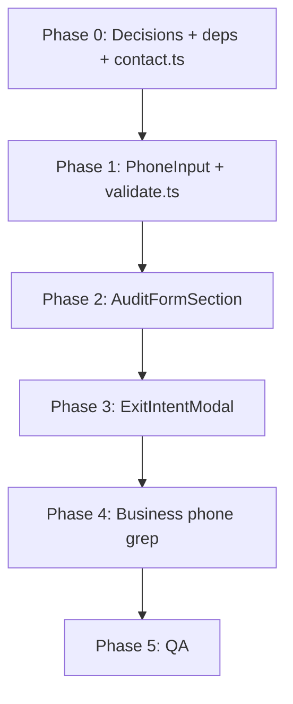

# Implementation plan: international phone input (forms)

**Status:** Implemented (2026-06-03).  
**Last updated:** 2026-06-03

---

## 1. Goals

| Goal | Detail |
|------|--------|
| **Form UX** | Country calling code via searchable dropdown (flag + dial code, e.g. 🇫🇷 +33); national number field accepts **digits only**; live validation per selected country. |
| **Search** | User can type country name, ISO code, or dial code (e.g. `France`, `33`, `+33`) and filter the list; selection locks prefix shown beside the input. |
| **Validation** | Reject invalid length/pattern for that country; no letters in the national number field; optional check that the full number is a possible valid mobile/line (library-backed). |
| **Storage** | Persist one canonical string to Supabase `contact_submissions.phone_number` (recommend **E.164**, e.g. `+447365519615`). |
| **Business vs lead** | **Your line:** `07365519615` (header, CTA, JSON-LD, “call us directly”). **Placeholder example for visitors:** keep `07442 116785` style in form hints only — not displayed as Tasklumas contact. |

---

## 2. Scope

### In scope

- `AuditFormSection.tsx` — main audit form phone field.
- `ExitIntentModal.tsx` — exit-intent capture field (+ align “call us directly” with `07365519615`).
- Shared UI: `PhoneInput` (or `InternationalPhoneField`) component + validation helpers.
- Submit pipeline: value passed to existing `phone_number` column (no migration required if column stays `text`).

### Out of scope (separate follow-up)

- Changing Supabase schema or RLS.
- SMS verification / OTP.
- Auto-detect country from IP (optional later).
- Refactoring entire audit form to `react-hook-form` + Zod (already in `package.json` but unused today).

### Related but tracked elsewhere

- Centralising **business** phone in `src/content/contact.ts` (see prior phone rollout plan).
- Footer phone when `SiteFooter` is built (`implementation_visuals.md` Phase 2.4).

---

## 3. Current state

| Location | Behaviour today |
|----------|-----------------|
| `AuditFormSection` | Single `<input type="tel">`; validation = ≥10 digits anywhere in string; placeholder `07365519615`. |
| `ExitIntentModal` | Single tel input; no country split; placeholder `07442 116785`; “call us” shows wrong business constant `+44 7442 116785`. |
| `contact_submissions.phone_number` | `text NOT NULL` — any string accepted. |
| Dependencies | `react-hook-form`, `zod`, `@hookform/resolvers` installed but **not** used on audit form. |

**Gaps:** No country-specific rules; users can paste `+33abc`; UK vs FR length not enforced; inconsistent business vs placeholder numbers.

---

## 4. Product decisions (lock before build)

| # | Decision | Recommendation | Your call |
|---|----------|----------------|-----------|
| 4.1 | **Default country** | `GB` (+44) — primary UK trades audience | ☐ |
| 4.2 | **Country list** | All countries supported by library, or curated (GB, US, IE, FR, …) | ☐ All / ☐ Curated |
| 4.3 | **Stored format** | E.164 (`+447365519615`) | ☐ |
| 4.4 | **Display in admin/Supabase** | Same E.164; optional format on read later | ☐ |
| 4.5 | **Placeholder (national field)** | Example only: `7442 116785` (no leading 0 when +44 selected) or `07442 116785` with helper text “without country code” | ☐ |
| 4.6 | **Strictness** | **Possible** number (length + pattern) vs **valid** (stricter; may reject some new ranges) | ☐ Possible recommended |
| 4.7 | **Paste handling** | If user pastes `+33612345678`, auto-switch country to FR and fill national part | ☐ Yes |
| 4.8 | **Business “call us” line** | Always `07365519615` / `tel:07365519615` in modal + header + `index.html` | ☐ |

Document chosen options in §4 table when approved.

---

## 5. Recommended technical approach

### 5.1 Library stack (evaluate one option)

Phone rules differ by country (length, leading zero, mobile prefixes). **Do not hand-roll** per-country regex tables.

| Option | Packages | Pros | Cons |
|--------|----------|------|------|
| **A (recommended)** | `react-phone-number-input` + `libphonenumber-js` | Mature; built-in country `<select>` with flags; search via native/filter pattern or upgrade to combobox; validates with same engine Google uses | Default styling needs Tailwind overrides; bundle ~+40–80KB gzip |
| **B** | `react-international-phone` | Polished searchable country dropdown out of the box; flags included | Another API to learn; verify a11y and bundle size |
| **C (custom)** | `libphonenumber-js` only + Headless UI combobox | Full control over UI | Most build time; easy to get wrong on edge cases |

**Recommendation:** **Option A** unless design review requires a fully custom combobox — then wrap Option A’s country metadata with a searchable list (Radix/Headless) fed by `libphonenumber-js` country list.

### 5.2 Validation rules (behaviour spec)

1. **Country selector**
   - Shows: flag emoji or SVG, country name, dial code (`+44`).
   - Filter: match on country name, ISO2 (`FR`), dial code (`33`, `+33`).
   - On select: set internal `country` state (`GB`, `FR`, …); show fixed `+XX` prefix (read-only) left of national input.

2. **National number input**
   - `inputMode="numeric"` / pattern that blocks letters on keypress.
   - Strip spaces/dashes for validation; optional display formatting (groups) via `AsYouType` from `libphonenumber-js`.
   - Max length derived from selected country (library), not a global `10`.

3. **On blur / submit**
   - Combine `countryCallingCode` + national digits → parse with `parsePhoneNumberFromString(value, country)`.
   - Valid if `isPossible()` (minimum) or `isValid()` (stricter) — per decision 4.6.
   - Error copy examples: “Enter a valid UK mobile number”, “This number is too short for France”.

4. **Paste**
   - If pasted string starts with `+`, parse and set country + national segments (decision 4.7).

5. **Submit value**
   - `phone_number: phoneNumber.format('E.164')` or `.number` from parsed result.
   - Never submit empty; block submit until valid.

### 5.3 UI composition (wireframe-level)

```
┌─────────────────────────────────────────────────────────────┐
│ Phone number *                                              │
│ ┌──────────────┬──┬──────────────────────────────────────┐ │
│ │ 🇬🇧 +44  ▼   │  │ 7365 519615                          │ │
│ └──────────────┴──┴──────────────────────────────────────┘ │
│   searchable      prefix   digits only, placeholder example  │
│   country pick    (fixed)                                    │
└─────────────────────────────────────────────────────────────┘
```

- **Desktop:** country trigger + prefix + input in one bordered control (matches existing `inputClasses` in audit form).
- **Mobile:** country trigger min-width 44px; dropdown opens full-width sheet or popover above keyboard.
- **Accessibility:** label `htmlFor`; country button `aria-haspopup="listbox"`; list searchable with keyboard (↑↓ Enter); error tied via `aria-describedby`.

### 5.4 File structure (planned)

```
src/
  content/
    contact.ts              # BUSINESS_PHONE_DISPLAY, BUSINESS_PHONE_TEL (07365519615)
  lib/
    phone/
      validate.ts           # parse, isPossible/isValid, toE164, getErrorMessage(country)
      countries.ts          # optional curated list + display order (GB first)
  components/
    phone/
      PhoneInput.tsx        # controlled component: value E.164, onChange, defaultCountry
      CountrySelect.tsx     # searchable list (if not satisfied by library default)
    AuditFormSection.tsx    # replace raw input with <PhoneInput />
    ExitIntentModal.tsx     # same component; fix “call us” to contact.ts
```

---

## 6. Implementation phases

### Phase 0 — Decisions & dependencies

| Step | Task |
|------|------|
| 0.1 | Fill §4 decision table. |
| 0.2 | Add chosen packages (`react-phone-number-input`, `libphonenumber-js`; types if needed). |
| 0.3 | Add `src/content/contact.ts` with business number `07365519615`. |
| 0.4 | Spike: render default library component in isolation; confirm search + FR validation in devtools. |

**Exit:** Default country GB; E.164 storage agreed; packages install cleanly.

---

### Phase 1 — Core `PhoneInput` component

| Step | Task |
|------|------|
| 1.1 | Implement controlled `PhoneInput`: props `value`, `onChange(E164 \| '')`, `defaultCountry="GB"`, `disabled`, `error`, `placeholder`. |
| 1.2 | Wire `libphonenumber-js` validation helpers in `validate.ts`. |
| 1.3 | Style with Tailwind to match audit form (border, focus ring amber, shake on error). |
| 1.4 | Implement searchable country UI (library default or custom combobox). |
| 1.5 | National field: digits only; show dial prefix `+33` not editable separately from country. |
| 1.6 | Paste handler for full international numbers. |

**Exit:** Storybook-style test page OR temporary route — can type “France”, select 🇫🇷, enter valid FR mobile, see green check; invalid length shows error.

---

### Phase 2 — Audit form integration

| Step | Task |
|------|------|
| 2.1 | Replace `form.phone_number` string with E.164 from `PhoneInput` (still one field in state). |
| 2.2 | Update `validateField('phone_number', …)` to delegate to `validate.ts` (remove naive `digits.length >= 10`). |
| 2.3 | Progress bar / check icon: valid only when `isPossible()` passes. |
| 2.4 | Placeholder: use **example** `7442 116785` when country is GB (decision 4.5) — clarify in label helper: “Your mobile, not our office line”. |
| 2.5 | On submit: insert E.164 into `contact_submissions.phone_number`. |
| 2.6 | Shake + inline error message on invalid submit (align with `implementation_visuals.md` 6C.2). |

**Exit:** Full audit form submits valid UK/FR numbers; invalid numbers blocked with clear errors.

---

### Phase 3 — Exit intent modal

| Step | Task |
|------|------|
| 3.1 | Reuse `<PhoneInput />` (compact variant prop if needed). |
| 3.2 | Validate before submit (same rules as audit form). |
| 3.3 | Replace `PHONE_NUMBER` constant with `contact.ts` (`07365519615`). |
| 3.4 | Keep visitor placeholder `07442 116785` only inside the input hint, not as “our number”. |

**Exit:** Modal lead capture stores E.164; “call us directly” shows correct business number.

---

### Phase 4 — Business phone consistency (quick win, same PR or adjacent)

| Step | Task |
|------|------|
| 4.1 | `StickyHeader`, `FinalCTAStrip`, `index.html` JSON-LD → `07365519615`. |
| 4.2 | Grep repo for `7442` / `116785` — only allowed in form placeholders. |

**Exit:** No stray `7442` as business contact anywhere.

---

### Phase 5 — QA & edge cases

| Case | Expected |
|------|----------|
| UK mobile `07365 519615` with GB selected | Valid → `+447365519615` |
| UK user enters leading `0` with +44 shown | Strip/format correctly (library handles national format) |
| France: search “33 France”, select, enter valid FR mobile | Valid → `+33…` |
| France: too few digits | Inline error, no submit |
| Letters in national field | Blocked or stripped |
| Paste `+33 6 12 34 56 78` | Country FR, national part filled |
| Switch country after typing | Re-validate; clear or re-parse national part |
| `prefers-reduced-motion` | No shake animation (or respect global CSS from Phase 8 visuals) |
| Screen reader | Country + number announced; errors read on submit |

**Devices:** iPhone Safari (numeric keyboard), Android Chrome, 375px width.

---

## 7. Data & backend

| Topic | Plan |
|-------|------|
| **Column** | Keep `phone_number text`; store E.164. |
| **Migration** | None required. |
| **RLS** | Unchanged (anon INSERT). |
| **Future** | Optional CHECK constraint or Edge Function validation — not v1. |
| **Analytics** | Optional: log `country` ISO in metadata later; not required for launch. |

---

## 8. Validation examples (acceptance criteria)

Use [libphonenumber-js test vectors](https://github.com/catamphetamine/libphonenumber-js) mentally; manual QA minimum:

| Country | Example valid (national part) | Must reject |
|---------|------------------------------|-------------|
| GB (+44) | `7365519615` or `07365519615` | `123`, `abc`, `7365519` (too short) |
| FR (+33) | Valid mobile length per library | 8 digits, letters |
| US (+1) | 10-digit national | 9 digits |

Full number stored always includes country code: e.g. `+447365519615`, not `07365519615` alone.

---

## 9. Styling & UX notes

- Match existing audit form: `border-stone-300`, `focus:ring-amber-400`, emerald check when valid.
- Country dropdown: max-height scroll, sticky search input at top.
- Do not show Tasklumas business number inside the phone field placeholder (avoids confusion with lead capture).
- Optional microcopy under field: “We’ll only use this to contact you about your audit.”

---

## 10. Risks & mitigations

| Risk | Mitigation |
|------|------------|
| Bundle size | Import only `libphonenumber-js/min` or country subset if needed |
| Over-strict `isValid()` rejects new UK ranges | Prefer `isPossible()` for submit (decision 4.6) |
| Users confused by +44 vs 07 | Helper text; `AsYouType` formatting |
| Duplicate logic in two forms | Single `PhoneInput` + `validate.ts` |
| Existing DB rows mixed formats | Old rows unchanged; new rows E.164 only |

---

## 11. Effort estimate

| Phase | Estimate |
|-------|----------|
| 0 + 1 (component + validation) | 1–1.5 days |
| 2 + 3 (form integrations) | 0.5–1 day |
| 4 (business phone cleanup) | 0.25 day |
| 5 (QA) | 0.5 day |
| **Total** | **~2–3 days** |

---

## 12. Definition of done

- [x] Both forms use shared international phone input with searchable country + flags.
- [x] National input is digits-only with per-country validation.
- [x] Supabase receives E.164 in `phone_number`.
- [x] Business contact `07365519615` everywhere public; `7442 116785` only as visitor placeholder example.
- [ ] Manual QA passed for GB and at least one other country (e.g. FR).
- [x] No new linter/type errors; `npm run build` succeeds.

---

## 13. Implementation order (summary)



---

## 14. References

- [libphonenumber-js](https://github.com/catamphetamine/libphonenumber-js) — parsing, `isPossible`, `isValid`, E.164
- [react-phone-number-input](https://github.com/catamphetamine/react-phone-number-input) — React component + country select
- Existing: `supabase/migrations/20260529181832_create_contact_submissions.sql`
- Related doc: `implementation_visuals.md` (Phase 6C form polish, Phase 7.5 placeholders)
