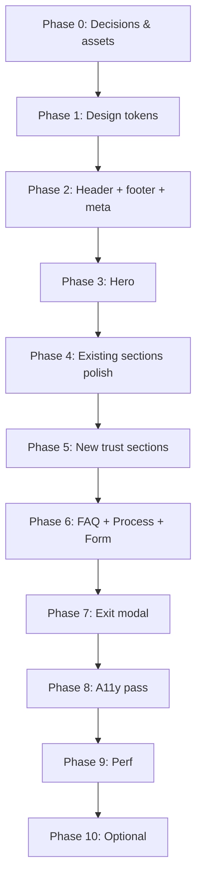

# Tasklumas — Frontend Visual Implementation Plan

**Scope:** Frontend only (UI, UX, assets, copy presentation, client-side behavior). Backend/Supabase wiring is out of scope unless noted as “display only.”

**Status:** Planning document — do not implement until phases are approved.

**Last updated:** 2026-06-03

---

## Goals

1. Increase **trust and credibility** before the audit form.
2. Improve **scanability** and reduce visual monotony on long scroll.
3. Polish **brand identity** (typography, tokens, share assets).
4. Raise **accessibility** and **perceived quality** (motion, focus, modals, forms).
5. Align **market/locale** presentation (UK vs US) across visible copy and examples.

---

## Success metrics (how we know it worked)

| Signal | Target (qualitative) |
|--------|----------------------|
| Form starts | Fewer bounces between Process and `#audit-form` |
| Time on page | Slightly higher scroll depth to form (analytics later) |
| Mobile UX | Header + final CTA feel compact; no horizontal overflow |
| Lighthouse (manual) | Accessibility ≥ 90 on landing; no obvious contrast failures |
| Share preview | Custom OG image + favicon (not Vite/Bolt defaults) |

---

## Design principles (carry through every phase)

- **One primary CTA color:** amber on slate (keep; refine tokens, don’t reinvent).
- **Proof before ask:** social proof and “what happens next” appear *before* the heavy form commitment.
- **Reduce sameness:** no more than two consecutive `stone-100` bands without a visual break.
- **Motion is optional:** all animations must respect `prefers-reduced-motion`.
- **Copy matches market:** pick primary audience (UK, US, or both) and apply consistently in placeholders, examples, spelling.

---

## Phase 0 — Decisions & assets (blockers)

Complete before visual build. No React required for most items.

| # | Task | Owner input needed | Deliverable |
|---|------|-------------------|-------------|
| 0.1 | **Primary market** | UK only / US only / both | One-line rule in this doc: e.g. “US trades, UK phone for founder” |
| 0.2 | **Brand fonts** | Approve 2 fonts (display + body) or “system only” | Font files or Google Fonts links |
| 0.3 | **Logo variants** | SVG or PNG: full, icon-only, light-on-dark | `/public/logo.svg`, `/public/logo-icon.svg` |
| 0.4 | **OG + favicon** | 1200×630 OG, 32/180 favicon | `/public/og.png`, `/public/favicon.ico` |
| 0.5 | **Founder photo** | Headshot for trust block | `/public/founder.jpg` (or placeholder policy) |
| 0.6 | **Case study material** | 2–3 anonymized wins (trade, city, rank change, quote) | Copy in `content/case-studies.ts` (future) or markdown |
| 0.7 | **Financial example numbers** | Avg job value per trade or one generic number | Copy for Financial Math section |

**Exit criteria:** Assets in `/public`, market rule written, case study copy approved.

---

## Phase 1 — Design system foundation

**Files likely touched:** `tailwind.config.js`, `index.css`, `index.html`, `src/index.css`

| # | Task | Details |
|---|------|---------|
| 1.1 | **Tailwind theme extend** | Semantic colors: `brand` (amber), `surface-dark` (slate-900), `surface-light` (stone-50/100), `success` (emerald). Map existing classes gradually. |
| 1.2 | **Typography** | Load fonts in `index.html`; set `font-display` / `font-sans` in config; apply to `h1–h3` and body. |
| 1.3 | **Spacing rhythm** | Standardize section padding: `py-20 md:py-28` → token `section-y` via `@apply` or shared class in `index.css`. |
| 1.4 | **CTA component (visual)** | Single `Button` or `CtaLink` variant: primary (amber), secondary (slate outline), sizes `sm` / `lg`. Replace duplicated class strings over time. |
| 1.5 | **Section shell** | `Section` wrapper: `id`, optional `label` (eyebrow), `title`, `description`, `variant` (`dark` \| `light` \| `accent`). |

**Exit criteria:** New sections can be built from tokens; one page section refactored as reference (e.g. Trust strip).

---

## Phase 2 — Global chrome & navigation

**Components:** `StickyHeader.tsx`, new `SiteFooter.tsx`, `App.tsx`

| # | Task | Details |
|---|------|---------|
| 2.1 | **Compact sticky header** | Reduce mobile height: logo `h-10` on scroll, `h-12` max; bar `h-16` not `h-24`. |
| 2.2 | **In-page anchor nav** | Desktop links: How it works · Guarantee · FAQ · Audit. Smooth scroll (already on `html`). Highlight active section (optional, IntersectionObserver). |
| 2.3 | **Header visibility** | Option A: show slim bar on hero (logo + CTA only). Option B: keep hide-until-scroll but faster threshold (50% not 80%). Decide in 0.1 usability test. |
| 2.4 | **Footer** | © Tasklumas, phone, email, placeholder Privacy/Terms links, optional social. Dark band matching final CTA. |
| 2.5 | **Meta & icons** | Wire `og:image`, `twitter:image`, favicon to `/public` assets from Phase 0. |

**Exit criteria:** Footer on every page load; header usable on 375px width; anchors scroll to correct sections.

---

## Phase 3 — Hero & above-the-fold

**Component:** `HeroSection.tsx`

| # | Task | Details |
|---|------|---------|
| 3.1 | **Visual proof** | Add Maps-style 3-pack mock (static image or built-in JSX cards with stars, “Call”, rankings). Keep or shrink floating pin animation. |
| 3.2 | **Trade/city specificity** | Subhead or badge: “For roofers, plumbers, HVAC & landscapers” + optional “Serving [market]” per 0.1. |
| 3.3 | **Dual CTA** | Primary → `#audit-form`. Secondary → `#process` or `#how-it-works` (“See how the audit works”). |
| 3.4 | **Background depth** | Subtle CSS grid or map-dot pattern at 5–8% opacity on `slate-900`. |
| 3.5 | **Hero motion** | Wrap `animate-float` / `pulse-ring` in `@media (prefers-reduced-motion: no-preference)`. |

**Exit criteria:** Hero communicates offer + proof in one viewport on common laptops; mobile CTA visible without excessive scroll.

---

## Phase 4 — Narrative sections (content + layout)

### 4A — Reality Check (`RealityCheckSection.tsx`)

| # | Task |
|---|------|
| 4A.1 | Add section eyebrow: “The problem”. |
| 4A.2 | Optional: replace generic competitor names with “Example results” disclaimer. |
| 4A.3 | Strengthen closing line typography (pull quote style). |

### 4B — How it works (`HowItWorksSection.tsx`)

| # | Task |
|---|------|
| 4B.1 | Add `id="how-it-works"` for anchors. |
| 4B.2 | Connector line between steps on desktop (visual timeline). |
| 4B.3 | Mid-page CTA copy variant: “Start my free audit” (not identical to hero). |

### 4C — Financial math (`FinancialMathSection.tsx`)

| # | Task |
|---|------|
| 4C.1 | Label bars with numbers from Phase 0.7 (e.g. “$8,500 avg job” vs “$1,200/mo”). |
| 4C.2 | Align spelling with market (“Math” vs “Maths”). |
| 4C.3 | Section eyebrow: “The maths” / “The math”. |

### 4D — Trust & metrics (`TrustSignalsStrip.tsx`, `MetricsSection.tsx`)

| # | Task |
|---|------|
| 4D.1 | Trust: add “Google Business Profile specialists” or similar concrete line. |
| 4D.2 | Metrics: fix counter UX — animate number only; static suffix (“Top 3”, “Day”, “Hour”). |
| 4D.3 | Optional: replace generic stats with verifiable ones once approved. |

**Exit criteria:** Each section has distinct visual rhythm; financial section shows real numbers.

---

## Phase 5 — New trust blocks (new components)

**New files (suggested):**

- `src/components/CaseStudiesSection.tsx`
- `src/components/FounderSection.tsx`
- `src/components/WhoItsForSection.tsx`
- `src/content/case-studies.ts` (data only)

| # | Task | Placement in `App.tsx` |
|---|------|------------------------|
| 5.1 | **Case studies** | 2–3 cards after Trust strip or after Reality Check |
| 5.2 | **Founder block** | Before audit form: photo, name, “I’ll call you within 4 hours” |
| 5.3 | **Who it’s for / not for** | Before FAQ or after How it works |
| 5.4 | **Vs alternatives** (optional table) | Before Financial Math — 3 columns: Ads / Shared leads / Tasklumas |

**Suggested page order after Phase 5:**

```
StickyHeader
Hero
RealityCheck
HowItWorks
WhoItsFor (new)
FinancialMath
TrustSignals
CaseStudies (new)
Metrics
FAQ
Founder (new)      ← optional merge with Process
ProcessSequence
AuditForm
FinalCTA
Footer (new)
ExitIntentModal
```

**Exit criteria:** At least one case study + founder visible before form; page order documented and stable.

---

## Phase 6 — FAQ, process & form climax

### 6A — FAQ (`FAQSection.tsx`)

| # | Task |
|---|------|
| 6A.1 | Add FAQs: pricing range, contract length, what “Top 3” means geographically. |
| 6A.2 | `aria-expanded`, `aria-controls`, `id` on panels; keyboard support. |
| 6A.3 | Consider `max-h` animation via CSS grid `0fr/1fr` for smoother expand. |

### 6B — Process (`ProcessSequence.tsx`)

| # | Task |
|---|------|
| 6B.1 | Add `id="process"`. |
| 6B.2 | Change background to white cards on `slate-50` or dark band — break stone-100 repetition with FAQ. |
| 6B.3 | Visual timeline connector between steps (desktop). |

### 6C — Audit form (`AuditFormSection.tsx`)

| # | Task |
|---|------|
| 6C.1 | Intro timeline: “Now → 4hr call → audit delivered”. |
| 6C.2 | Inline error messages (not shake-only). |
| 6C.3 | Privacy microcopy + link to footer Privacy (when exists). |
| 6C.4 | Migrate to `InputField` / `SelectField` for consistent labels/focus/errors. |
| 6C.5 | Success state: expanded next steps + optional “Add to calendar” (frontend link only). |
| 6C.6 | Placeholders per market rule (Phase 0.1). |

### 6D — Final CTA (`FinalCTAStrip.tsx`)

| # | Task |
|---|------|
| 6D.1 | Mobile: audit + phone primary; email icon-only or `mailto` in footer only. |
| 6D.2 | CTA copy variant: “Claim my free audit”. |

**Exit criteria:** Form section feels like the page climax; FAQ/Process visually distinct from each other.

---

## Phase 7 — Exit intent modal (UX polish)

**Component:** `ExitIntentModal.tsx`

| # | Task |
|---|------|
| 7.1 | `sessionStorage` key: don’t show again for 7 days after dismiss. |
| 7.2 | Desktop: optional `mouseleave` on `document` (top 20px) in addition to scroll heuristic — pick one behavior to avoid annoyance. |
| 7.3 | Focus trap, Escape close, `aria-modal`, labelled close (“Close dialog”). |
| 7.4 | `prefers-reduced-motion`: no backdrop blur animation. |
| 7.5 | Phone placeholder aligned with market (Phase 0.1). |

**Exit criteria:** Modal is accessible; doesn’t reappear every session; mobile scroll doesn’t trigger repeatedly.

---

## Phase 8 — Accessibility & motion (cross-cutting)

| # | Task | Files |
|---|------|-------|
| 8.1 | Global `prefers-reduced-motion` in `index.css` | Disable shake, float, pulse, reveal transforms |
| 8.2 | Focus rings on all interactive elements | Especially amber buttons on white |
| 8.3 | Skip link | “Skip to audit form” first focusable element |
| 8.4 | Color contrast audit | Hero amber on slate, emerald on stone |
| 8.5 | Images | Meaningful `alt` on logo, founder, case study screenshots |

**Exit criteria:** Manual keyboard pass entire page; reduced motion disables nonessential animation.

---

## Phase 9 — Performance (frontend bundle)

| # | Task |
|---|------|
| 9.1 | `React.lazy` + `Suspense` for `ExitIntentModal` |
| 9.2 | Defer Supabase client import until form/modal submit (dynamic import) — still frontend, smaller initial JS |
| 9.3 | Optimize images: WebP, `width`/`height` on imgs to prevent CLS |
| 9.4 | Optional: lazy reveal only below fold |

**Exit criteria:** Initial JS bundle meaningfully smaller; no layout shift on logo/hero image load.

---

## Phase 10 — Optional enhancements (later)

| # | Feature | Notes |
|---|---------|-------|
| 10.1 | 60–90s founder video embed | Hero or before form |
| 10.2 | Interactive “rank checker” mock | Frontend-only wizard; no API |
| 10.3 | Trade-specific landing variants | Query param `?trade=roofer` swaps hero line |
| 10.4 | Dark/light section illustrations | Custom SVG map pack per trade |

---

## File & component map

| Area | Primary files |
|------|----------------|
| Layout shell | `App.tsx`, new `SiteFooter.tsx`, `Section.tsx` (new) |
| Chrome | `StickyHeader.tsx` |
| Sections | `HeroSection`, `RealityCheckSection`, `HowItWorksSection`, `FinancialMathSection`, `TrustSignalsStrip`, `MetricsSection`, `FAQSection`, `ProcessSequence`, `AuditFormSection`, `FinalCTAStrip` |
| New sections | `CaseStudiesSection`, `FounderSection`, `WhoItsForSection` |
| UI primitives | `src/components/ui/Button.tsx`, use `InputField`, `SelectField` |
| Tokens & global CSS | `tailwind.config.js`, `src/index.css` |
| Content data | `src/content/case-studies.ts`, `src/content/faqs.ts` (extract from components) |
| Assets | `/public/logo.*`, `/public/og.png`, `/public/founder.jpg` |
| Meta | `index.html` |

---

## Implementation order (recommended)



**Parallelizable after P1:** P3 (hero) and P4 (section polish) can run in parallel. P5 depends on Phase 0 case study copy.

---

## Testing checklist (per phase, manual)

- [ ] iPhone SE / 375px — header, hero CTA, form, final CTA
- [ ] iPad / desktop — anchor nav, grid layouts
- [ ] Keyboard only — tab order, FAQ, modal, form
- [ ] `prefers-reduced-motion: reduce` — no float/shake/reveal
- [ ] Share debugger (LinkedIn/Twitter card preview) — OG image correct
- [ ] All `#audit-form` and section anchors scroll with sticky header offset (add `scroll-margin-top` on sections if needed)

---

## Out of scope (this plan)

- Supabase schema changes, RLS, email notifications
- Analytics / GTM / Meta pixel
- CMS integration
- Multi-page site or blog
- A/B testing infrastructure

---

## Open questions (resolve in Phase 0)

1. Primary market: **UK / US / both**?
2. Show pricing range on page or only on call?
3. Real client logos/screenshots vs illustrated mocks only?
4. Keep scroll-based exit modal or switch to desktop mouse-leave only?
5. Founder video in v1 or v2?

---

## Changelog

| Date | Change |
|------|--------|
| 2026-06-03 | Initial plan from frontend review brainstorm |
